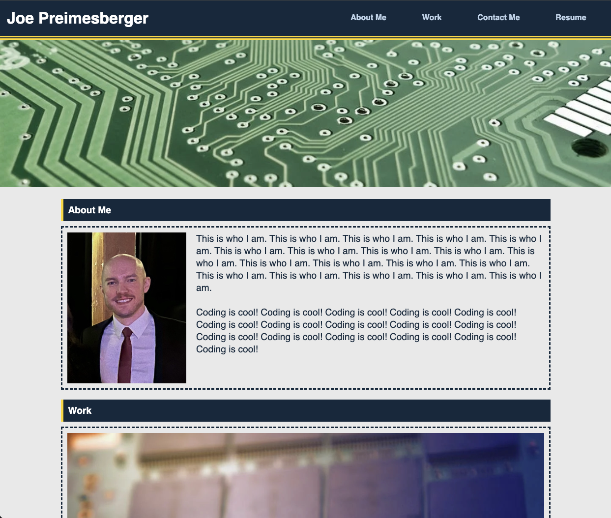

# Joe Preimesberger's Portfolio

## Description

The purpose of this project is to create a portfolio website of coding projects for potential future employers to view. This website was created using core skills we recently learned in class: flexbox, media queries, and CSS variables.

## Installation

N/A

## Usage

The website will appear as it does in the following screenshot:

## Credits

N/A

## License

Copyright (c) Joe Preimesberger

Licensed under the MIT license.